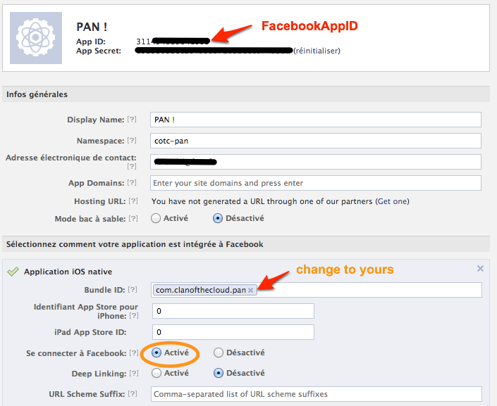

Facebook {#facebook_ref}
========

## Table of Content

1. [Facebook Developer](#toc1)
2. [Fixing platform specific issues](#facebook_troubleshooting)
3. [Facebook SDK for Unity](#toc2)
4. [Using it](#toc3)

# Setup a Facebook App {#toc1}

To be able to log in Clan of the Cloud with the user's facebook account, you need to create a [Facebook App](http://developers.facebook.com/)

On Facebook Developer website, check the following settings :

# Download the Facebook SDK for Unity {#toc2}

Download the facebook SDK for Unity [here](https://developers.facebook.com/docs/unity/) and import the package into your project.

Configure your AppID through the Facebook Settings menu in Unity. Do not forget this step as facebook will throw an error upon usage otherwise.

# Fixing platform specific issues {#facebook_troubleshooting}

When compiling for iOS, you may have to tweak some settings if the resulting project fails to compile with an error related to an `autorelease` call or something like `no known class method for selector 'publishInstall:withHandler:'` or `Error: ARC forbids explicit message send of 'autorelease'`. Open your project properties (select your project at the root of the project tree), go to the *Build Phases* tab, and under *Compile Sources*, double click on FbUnityInterface.mm and type in `-fno-objc-arc` to disable ARC for facebook. This step may not be required anymore at the time you are reading this though, so just try without it first.

When compiling for Android, you may get an error saying `java.lang.IllegalArgumentException: already added: Landroid/support/v4/accessibilityservice/AccessibilityServiceInfoCompat;`. This is caused by a conflict between the CotC SDK and the facebook plugins, which use a different build system although they reference the same library. In this case, you need to remove the `Assets/Plugins/Android/facebook/libs/android-support-v4.jar` and associated meta files.

# Using the Facebook integration plugin {#toc3}

Import the Unity SDK Facebook Integration package into your project.

Put the CotcFacebookIntegration object on your scene, from the `Cotc.FacebookIntegration/Prefabs` folder.

From your code, find the object as for the Clan of the Cloud SDK and call methods on it.

~~~~{.cs}
	var fb = FindObjectOfType<CotcFacebookIntegration>();
	fb.LoginWithFacebook(Cloud).Done(gamerResult => { ... });
~~~~
