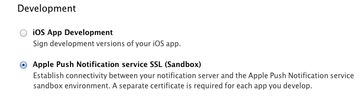
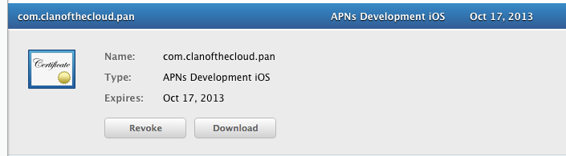
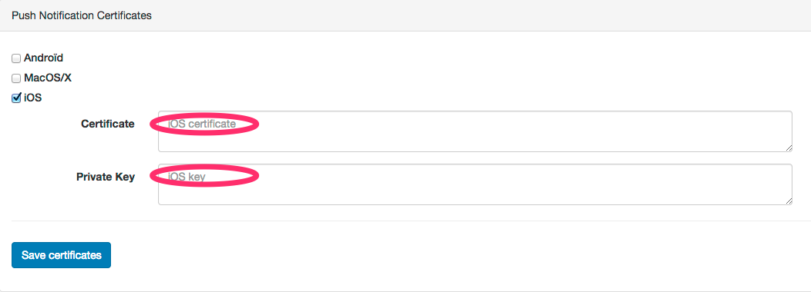
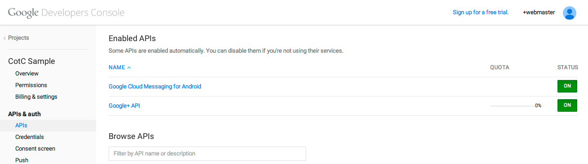
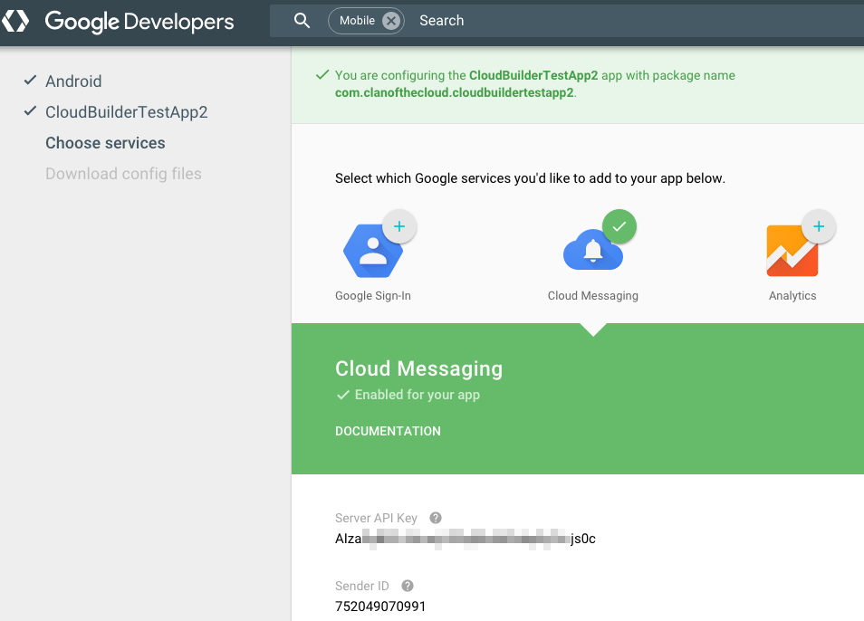
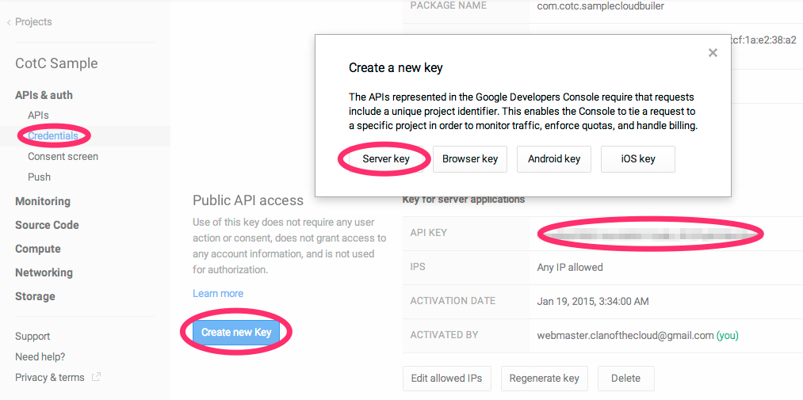

Push Notification {#push}
========

Push notifications (not to be confused with @ref CotcSdk.PushNotification "the PushNotification class") are provided with the push notification package, which may be downloaded separately.

Additionally, push notifications require server side configuration. This documentation will describe how to set it up like any mobile application, and then how to integrate the SDK. We recommend that you perform the former steps first, since the changes made to the configuration on Google/Apple sides need some delay to take effect.

## Table of Contents

1. [Push Notification for iOS](#toc_push_1)
2. [Push Notification for Android](#toc_push_2)
  
- - - -

# Setup Notifications for iOS {#toc_push_1}

On iOS, push notifications use the Apple Push Notification Service, which we'll describe how to set up in the following paragraphs.

First, set up a certificate with Push notifications enabled on the [Apple Developer Center](http://developer.apple.com/)

Download it,

and convert it to .pem format with the following command:
~~~
openssl x509 -in certificate.cer -inform DER -outform PEM -out certificat-aps-dev
~~~

You'll also need to convert the **private** key used to generate this certificate to the .pem format. To do this, you first need to export your private key to p12 format by using the Keychain Access tool on your Mac. Launch Keychain Access and right click on the certificate that you have just downloaded and installed, and select the "Export" option, and then the .p12 format.

Once this is done, just convert your private key to .pem format with the following command:
~~~
openssl pkcs12 -in private_push_key.p12 -out push-key-dev.pem -nodes
~~~

Once you've got your two .pem files, open a web page to our [Back Office](https://account.clanofthecloud.com), tick the iOS box inside the the "Push Notification Certificates" in your Status page, and fill respectively the "Certificate" and "Private Key" cells with the contents of the files you just created at the previous step (see above).

Then, you simply have to import the Cotc.PushNotifications package. When you build your application, check that you are using the provisioning profile for the application for which you enabled push notifications. Everything should be automatic with Xcode though.

Push notifications require no further configuration on your side. You should not even have to implement anything: just placing the `CotcPushNotificationsGameObject` on your scenes will ensure that everything works fine. It will transparently ask for push notifications permission upon login done with the main CotC SDK Game Object and register the device for push notifications. When a message has been delivered successfully (processed by the SDK, raised via #CotcSdk.DomainEventLoop.ReceivedEvent), the application badge is reseted.

- - - -

# Setting up notifications for Android (GCM) {#toc_push_2}

In case you need some more information about how Google Cloud Messaging works, please have a look at the [official Google documentation](https://developer.android.com/google/gcm/gcm.html). Otherwise, by following the steps below, you should be able to have your application manage push notifications pretty quickly.

First, you need to setup a Google Application. Since this is changing quite rapidly at the time of writing, please follow the previous guide for information on how to do it. Once this is done, this Google Application needs to reference the Google Cloud Messaging for Android API. This is done from the APIs section of the Google Developer Console for your project.

In case you are using the new interface, it may look more like the following capture. In this case, when following the instructions above, follow the page [add Cloud Messaging to your existing app](https://developers.google.com/cloud-messaging/android/client) and click on the button "Get a configuration file". Then you need to input information about your application (remember to sign in with your Google Developer account first). In the next screen you will obtain everything needed to set up GCM: the API key to set in the backoffice and the sender ID to set in the manifest.

Next step is to create a Public API key. To do so, select the Credentials section, just below the APIs section in the previous step, scroll down to the bottom of the page, and click the "Create new Key" button for the Public API access list of keys. Then select "Server key" option, and then "Create", not modifying anything. You should now have a new, valid API key.

Once this is done, you're almost finished with parameterization, and only some bits of code will be needed. But first, you need to declare your Google Application with Clan of the Cloud through your [Back Office web page](https://account.clanofthecloud.com). Now it's straightforward. Just tick the Android box inside the "Push Notification Certificates" in your Status page, and fill the "senderID" cell with the Google Application project number, and the "apiKey" cell with the key you just created at the previous step (see above).

Now everything's been done on the Google Application side, we need to add a few snippets of code, so your application can communicate with the Google Cloud Messaging servers. First thing to modify is your AndroidManifest.xml, which is located under Assets/Plugins/Android.

Inside the `<application>` tag, make sure to have the following entries:
~~~
	<meta-data android:name="cotc.GcmSenderId" android:value="\ XXXXXXXXXX" />
	<meta-data android:name="cotc.GcmNotificationIcon" android:resource="@drawable/ic_stat_ic_notification" />
	<meta-data android:name="cotc.GcmNotificationTitle" android:value="Cotc sample" />

	<receiver
		android:name="com.google.android.gms.gcm.GcmReceiver"
		android:exported="true"
		android:permission="com.google.android.c2dm.permission.SEND" >
		<intent-filter>
			<action android:name="com.google.android.c2dm.intent.RECEIVE" />
			<category android:name="com.clanofthecloud.sampleunityproject" />
		</intent-filter>
	</receiver>
~~~

You need to change the following:

- `<category android:name="com.clanofthecloud.sampleunityproject" />` to the Bundle Identifier of your application (under Player Settings, Android, Identification).
- `<meta-data android:name="cotc.GcmSenderId" android:value="\ XXXXXXXXXX" />` to the sender ID that you received when creating the application. Note that the first backslash + space are necessary, else the field will be interpreted as an integer and might overflow, breaking the application silently (if you spot an INVALID_PARAMETERS message in the log, double check that).
- `cotc.GcmNotificationIcon` node with the name of a resource to be used as icon.
- `cotc.GcmNotificationTitle` node with the name of your application.
- If you are using facebook, you may need to remove `android-support-v4.jar` under Assets/Plugins/Android/Facebook/libs.

Your application is now ready to receive push notifications from Google Cloud Messaging! No further configuration is required on your side: just placing the `CotcPushNotificationsGameObject` on your scenes will ensure that everything works fine. It will transparently register for notifications upon login done with the main CotC SDK Game Object. Notifications will be received via the standard GCM service (running in background on your device), that starts a small piece of code embedded in our SDK upon event, showing a notification using the parameters set in the manifest.
