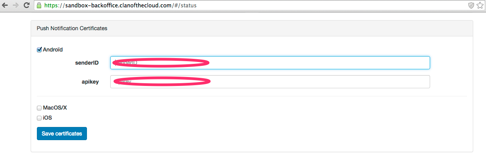

Push Notification {#push_ref}
========

## Table of Content

1. [Push Notification for iOS](#toc_push_1)
2. [Push Notification for Android](#toc_push_2)

   
- - - -

# Setup Notification for iOS {#toc_push_1}

First, set up a certificate with Push notifications enabled on the [Apple Developer Center](http://developer.apple.com/)

Download it,

and convert it to .pem format with the following command:
~~~
openssl x509 -in certificate.cer -inform DER -outform PEM -out certificat-aps-dev
~~~

You'll also need to convert the **private** key used to generate this certificate to the .pem format. To do this, you first need to export your private key to p12 format by using the Keychain Access tool on your Mac. Launch Keychain Access and right click on the certificate that you have just downloaded and installed, and select the "Export" option, and then the .p12 format.

Once this is done, just convert your private key to .pem format with the following command:
~~~
openssl pkcs12 -in private_push_key.p12 -out push-key-dev.pem -nodes
~~~

Once you've got your two .pem files, open a web page to our [Back Office](https://account.clanofthecloud.com), tick the iOS box inside the the "Push Notification Certificates" in your Status page, and fill respectively the "Certificate" and "Private Key" cells with the contents of the files you just created at the previous step (see above).

Finally, a little piece of code is needed in your AppDelegate.mm file:

~~~
#include "CClan.h"

- (void)application:(UIApplication *)application didRegisterForRemoteNotificationsWithDeviceToken:(NSData *)deviceToken {
	CloudBuilder::AchieveRegisterDevice(deviceToken.length, deviceToken.bytes);
}

- (void)application:(UIApplication *)application didFailToRegisterForRemoteNotificationsWithError:(NSError *)error  {
    NSLog(@"Error in registration. Error: %@ : %@", error, [error localizedDescription]); 
} 

// Handle an actual notification
- (void)application:(UIApplication *)application didReceiveRemoteNotification:(NSDictionary *)userInfo {
	// ...

    // this one is needed to reset the bagde number on the App Icon
    application.applicationIconBadgeNumber = 0;
}
~~~
   
- - - -

# Setup Notification for Android {#toc_push_2}

In case you need some more information about how Google Cloud Messaging works, please have a look at the [official Google documentation](https://developer.android.com/google/gcm/gcm.html). Otherwise, by following the steps below, you should be able to have your application manage push notifications pretty quickly.

First, you need to setup a Google Application. The necessary steps to do this are explained in details in the [Google+ section](@ref gp_toc1). Once this is done, this Google Application needs to reference the Google Cloud Messaging for Android API. This is done from the APIs section of the Google Developer Console for your project.

Next step is to create a Public API key. To do so, select the Credentials section, just below the APIs section in the previous step, scroll down to the bottom of the page, and click the "Create new Key" button for the Public API access list of keys. Then select "Server key" option, and then "Create", not modifying anything. You should now have a new, valid API key.

Once this is done, you're almost finished with parameterization, and only some bits of code will be needed. But first, you need to declare your Google Application with Clan of the Cloud through your [Back Office web page](https://account.clanofthecloud.com). Now it's straightforward. Just tick the Android box inside the "Push Notification Certificates" in your Status page, and fill the "senderID" cell with the Google Application project number, and the "apiKey" cell with the key you just created at the previous step (see above).

Now everything's been done on the Google Application side, we need to add a few snippets of code, so your application can communicate with the Google Cloud Messaging servers. First thing to modify is your AndroidManifest.xml, which needs a few new sections. Each time you see "com.yourcompany.yourapp", you need to replace that with the value of the package attribute from your manifest.

Inside the <manifest> tag, make sure to have the following entries:
~~~
    <uses-permission android:name="android.permission.INTERNET"></uses-permission>
    <uses-permission android:name="android.permission.GET_ACCOUNTS" />
    <uses-permission android:name="android.permission.WAKE_LOCK" />

    <permission	android:name="com.yourcompany.yourapp.permission.C2D_MESSAGE" android:protectionLevel="signature" />
    <uses-permission android:name="com.yourcompany.yourapp.permission.C2D_MESSAGE" />
    <uses-permission android:name="com.google.android.c2dm.permission.RECEIVE" />
~~~

Inside the <application> tag, make sure to have the following entries:
~~~
	<receiver android:name="com.google.android.gcm.GCMBroadcastReceiver" android:permission="com.google.android.c2dm.permission.SEND" >
        <intent-filter>
            <!-- Receives the actual messages. -->
            <action android:name="com.google.android.c2dm.intent.RECEIVE" />
            <!-- Receives the registration id. -->
            <action android:name="com.google.android.c2dm.intent.REGISTRATION" />
		    <category android:name="com.yourcompany.yourapp" />
		</intent-filter>   
	</receiver>

	<service android:name=".GCMIntentService" android:enabled="true" />
~~~

Your application is now ready to receive push notifications from Google Cloud Messaging. We just need to modify the Activity so these push notifications are actually processed and in turn invoke Clan of the Cloud program loop.
Your activity Java file has to be modified so it includes the following content:
~~~
package com.yourcompany.yourapp;

import android.content.BroadcastReceiver;
import android.content.Intent;
import android.content.IntentFilter;

import com.yourcompany.yourapp.GCMIntentService;
import com.clanofthecloud.cloudbuilder.CloudBuilder;

public class YourActivity extends Activity
{
    ...
	IntentFilter gcmFilter;
    ...
    
	@Override
    public void onCreate(Bundle savedInstanceState)
    {
        GCMIntentService.Init(this);
    	gcmFilter = new IntentFilter();
        gcmFilter.addAction(GCMIntentService.NotificationName);
    }
    
    ...
    
	private final BroadcastReceiver gcmReceiver = new BroadcastReceiver()
    {
        @Override
        public void onReceive(Context context, Intent intent)
        {
        	GCMIntentService.HandleNotification(intent);
        }
    };
    
    ...
    
    @Override
    public synchronized void onResume()
    {
        super.onResume();
        ...
        registerReceiver(gcmReceiver, gcmFilter);
        CloudBuilder.Resumed();
        CloudBuilder.HandleNotification(null);
        ...
    }
    
    ...
    
    public synchronized void onPause()
    {
        super.onPause();
        ...
        CloudBuilder.Suspended();
        unregisterReceiver(gcmReceiver);
        ...
   }
}
~~~

Finally, you need to customize the generic GCMIntentService Java file that you have received with the Android sample:

~~~
package com.yourcompany.yourapp;

import android.content.Context;
import android.content.Intent;

import com.clanofthecloud.cloudbuilder.CloudBuilder;

public class GCMIntentService extends CloudBuilder {

    //  SenderID should contain the Project Number, as found in the Google Developer Console when you
    //  you created the Google Application.
	public static String SenderID = "xxxxxxxxxxxx";
    //  This needs to be unique, so you can use your package name, and must end with GCM_RECEIVED_ACTION.
	public static String NotificationName = "com.yourcompany.yourapp.GCM_RECEIVED_ACTION";
	
	
	public static void Init (Context context) {
		CloudBuilder.Init(context, SenderID, null);
	}

	@Override
	public int GetNotificationIcon() {
		//  Should point to an icon in your project resources, which will be used
        //  to decorate the push notification.
        return R.drawable.ic_launcher;
	}
	
	@Override
	public String GetNotificationTitle() {
		//  Should contain the string you want to see displayed when the push
        //  notification is presented on your device.
        return "CLI notification";
	}
	
	@Override
	public Intent GetIntent(Context context)
	{
        return new Intent(context, MicroConsole.class);
	}

	@Override
	public String GetNotificationName() {
		return NotificationName;
	}	
	
}
~~~

That's it, you're done and can now begin to send push notifications to your Android application!